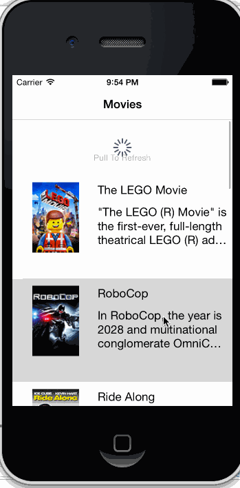

rottentomatoes3
===============

rottentomatoes3

Overview: Build a Rotten Tomatoes app.

Hours to complete: 12

User Stories completed:
	- User can view a list of movies from Rotten Tomatoes.  Poster images must be loading asynchronously.
	- User can view movie details by tapping on a cell
	- User sees loading state while waiting for movies API.  You can use one of the 3rd party libraries here.
	- User can pull to refresh the movie list.

User stories not completed but have some idea what to do:
	- User sees error message when there's a networking error.  You may not use UIAlertView to display the error.  
	
	

